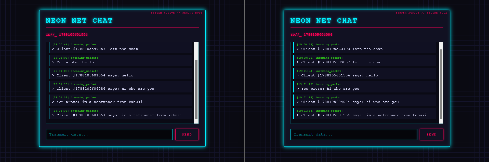

Absolutely — since this is a **project README**, I’d make it feel polished and technical rather than just describing the UI. The key thing worth highlighting is that the cyberpunk terminal is **actually powered by FastAPI + WebSockets**, so the aesthetic has a real-time backend underneath it.

# 🌐 Cyberpunk Netrunner Terminal

> **A real-time cyberpunk communication terminal powered by FastAPI WebSockets.**

A sci-fi-inspired **Netrunner Terminal** built to explore real-time communication using **FastAPI WebSockets**.

Instead of a conventional chat interface, the project presents communication as an immersive digital terminal — complete with a dynamic cyberpunk UI, live data packets, system timestamps, audio feedback, and glitch effects.

The frontend is built using **HTML5, CSS3, and Vanilla JavaScript**, while **FastAPI + WebSockets** handle real-time bidirectional communication.

---


## ⚡ What is this?

The Netrunner Terminal simulates a futuristic communication node where users can connect to a server and exchange messages in real time.

The core idea is simple:

```text
Client
   │
   │ WebSocket Connection
   ▼
┌───────────────────────┐
│     FastAPI Server    │
│                       │
│   WebSocket Endpoint  │
└───────────┬───────────┘
            │
            │ Real-time messages
            ▼
       Connected Clients
```

Unlike traditional HTTP request/response communication, the WebSocket connection remains open, allowing the server and client to exchange data continuously.

---

## 🚀 Features

### 🌐 Real-Time WebSocket Communication

Built using **FastAPI WebSockets** to establish persistent, bidirectional communication between the browser and backend.

Messages can be transmitted without repeatedly creating new HTTP requests.

---

### 🧬 Cyberpunk UI

The interface is designed around a futuristic **Netrunner / underground terminal** aesthetic.

Features include:

* Dynamic matrix-style background
* Neon cyan and pink color palette
* Glowing interface elements
* Retro-futuristic scrollbars
* Terminal-style message formatting
* Responsive layout

---

### 🧪 Live Glitch Title

The main terminal title includes a randomized **matrix-code decryption effect**.

The animation periodically transforms the title into scrambled characters before reconstructing it.

---

### 🆔 Dynamic Client Identification

Every connected client receives a dynamically generated node identifier based on the connection timestamp.

Example:

```text
ID//_ 1725038472910
```

This gives every terminal session its own temporary identity.

---

### 🔊 Web Audio API Feedback

The terminal uses the browser's **Web Audio API** to synthesize sounds directly in JavaScript.

No external audio files are required.

Different frequencies are used to represent different types of activity:

```text
Outgoing Transmission
        ↓
 Low-frequency synth click

Incoming Packet
        ↓
 High-frequency alert
```

This makes the interface feel more like an interactive terminal rather than a conventional chat application.

---

### 📡 Data Transmission Log

Messages appear as incoming **data packets** with system timestamps.

Example:

```text
[19:42:17] DATA_PACKET // INCOMING

> connection established
> transmission received
```

Each message is automatically timestamped using the client's local time.

---

### 📜 Smart Auto-Scroll

The terminal automatically follows incoming transmissions and smoothly scrolls toward the latest packet.

This keeps the most recent communication visible without requiring manual scrolling.

---

## 🎛️ Interactive Interface

### Data Transmission Field

A neon-bordered transmission field allows users to send messages through the active WebSocket connection.

The field dynamically changes its glow when focused.

### Transmission Button

The submit button uses a heavy terminal-style border with:

* Neon hover effects
* Pink fill animation
* Intensified glow
* Interactive visual feedback

---

## 🛠️ Tech Stack

### Backend

* **Python**
* **FastAPI**
* **WebSockets**
* **Uvicorn**

### Frontend

* **HTML5**
* **CSS3**
* **CSS Variables**
* **Vanilla JavaScript**
* **Web Audio API**

No frontend framework is required.

---

## 🧠 What I Learned

This project was primarily built to understand **real-time communication** rather than simply creating another UI.

Through this project, I explored:

* HTTP vs WebSocket communication
* Persistent connections
* Bidirectional communication
* WebSocket connection lifecycle
* Sending and receiving messages in real time
* Client/server communication
* Handling connection and disconnection events
* Browser WebSocket APIs
* FastAPI WebSocket endpoints
* Real-time UI updates
* Web Audio API
* Frontend event-driven programming

The project helped me understand why WebSockets are useful for applications where the server needs to push information to clients without waiting for another request.

---

## 🔄 Communication Flow

A typical message transmission follows this flow:

```text
        Browser
           │
           │  WebSocket Connect
           ▼
     FastAPI Server
           │
           │  Connection Established
           ▼
     Persistent Socket
           │
     ┌─────┴─────┐
     │           │
     ▼           ▼
   SEND        RECEIVE
     │           │
     ▼           ▼
  Message    Data Packet
     │           │
     └─────┬─────┘
           ▼
      Terminal UI
           │
           ▼
      Audio Feedback
```

---

## ▶️ Running the Project

### 1. Clone the repository

```bash
git clone <your-repository-url>
cd cyberpunk-netrunner-terminal
```

### 2. Create a virtual environment

```bash
python -m venv venv
```

Activate it:

**Windows**

```bash
venv\Scripts\activate
```

**Linux / macOS**

```bash
source venv/bin/activate
```

### 3. Install dependencies

```bash
pip install fastapi uvicorn
```

### 4. Start the server

```bash
uvicorn main:app --reload
```

The terminal will be available at:

```text
http://127.0.0.1:8000
```

---

## 🔌 WebSocket Endpoint

The application exposes a WebSocket endpoint used for real-time communication.

Example:

```text
ws://127.0.0.1:8000/ws
```

The browser establishes the connection using the native JavaScript WebSocket API:

```javascript
const socket = new WebSocket("ws://127.0.0.1:8000/ws");
```

Once connected, the client can send and receive messages without repeatedly making HTTP requests.

---

## 🎯 Project Goal

This project started as an experiment with **WebSockets and real-time communication**, but the goal was also to make the technical concept visually engaging.

Rather than building a generic chat application, I wanted to create something that **feels like a terminal connected to a live network node**.

The result is a combination of:

**Real-time backend communication + interactive frontend engineering + cyberpunk UI design.**

**Built with Python, FastAPI, WebSockets, and a little cyberpunk obsession.** ⚡
